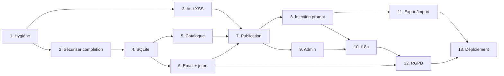

# Planning de migration EduChat → plateforme de tuteurs socratiques

Ce dossier contient l'analyse du site existant, les décisions d'architecture, et un plan en **13 étapes** — chaque fiche se termine par un **prompt autonome à copier-coller dans une nouvelle session Claude Code** pour réaliser l'étape.

## Comment l'utiliser

1. Lire [00-analyse-existant.md](00-analyse-existant.md) (ce que fait le site aujourd'hui) et [decisions-techniques.md](decisions-techniques.md) (les choix structurants).
2. Répondre aux questions de [questions-suggestions.md](questions-suggestions.md) — surtout les 5 premières, qui conditionnent les étapes 5 à 9.
3. Dérouler les étapes **dans l'ordre** : ouvrir la fiche, copier le bloc « Prompt à copier-coller », le coller dans une session Claude Code, vérifier les critères d'acceptation, commiter. Une étape ≈ une session de travail.

## Les 13 étapes

| # | Fiche | Dépend de | Estimation |
|---|---|---|---|
| 1 | [Hygiène du dépôt : secrets, commit de référence, code mort](01-hygiene-depot.md) | — | 1 session |
| 2 | [Verrouiller `/api/completion` (edge→Node) + compteur de tokens](02-securiser-api-completion.md) | 1 | 1 session |
| 3 | [Assainir le rendu (anti-XSS) et durcir l'import JSON](03-sanitisation-xss.md) | 1 | 1 session |
| 4 | [Base SQLite et modèle de données](04-base-sqlite.md) | 2 | 1 session |
| 5 | [API prompts (lecture) + page d'accueil catalogue triable](05-catalogue-accueil.md) | 4 | 1-2 sessions |
| 6 | [Vérification email et jeton promptagogue](06-verification-email.md) | 4 | 1-2 sessions |
| 7 | [Publication, versionnement, quotas d'upload](07-publication-quotas.md) | 3, 5, 6 | 1-2 sessions |
| 8 | [Injection serveur du prompt système + statistiques d'usage](08-injection-prompt-stats.md) | 7 | 1 session |
| 9 | [Administration et modération](09-administration.md) | 7 | 1 session |
| 10 | [Internationalisation fr/en/it/de](10-i18n.md) | 8, 9 | 2 sessions |
| 11 | [Export/import consolidés et robustesse de l'historique](11-export-import.md) | 8 | 1 session |
| 12 | [Mise en conformité RGPD/nLPD](12-rgpd.md) | 6, 10 | 1 session |
| 13 | [Déploiement OVH, DNS et recette finale](13-deploiement-ovh.md) | 11, 12 | 1-2 sessions + actions manuelles OVH |

**Total : ~14-17 sessions.** Palier déployable dès la fin de l'étape 8 (catalogue + tuteurs fonctionnels et sécurisés) ; les étapes 9-13 complètent admin, i18n, conformité et mise en production.

## Règles d'or (valables à toutes les étapes)

- **Jamais de secret en query string** : le cron `log_to_web.sh` publie les logs Apache sur le web.
- **Jamais commiter** `.env`, `secret.txt`, `data/` — le `.gitignore` les couvre, mais vérifier avant chaque commit.
- **La base SQLite vit hors `/var/www/html`** (`DATA_DIR`) : un des deux VirtualHost sert ce répertoire en statique.
- **Ne pas réordonner les étapes de sécurité** : la sanitisation (3) doit précéder l'ouverture des publications (7) ; le verrouillage de `/api/completion` (2) doit précéder toute publicité du site.
- L'ordre des étapes garantit que la page `/rgpd` réécrite (12) est en production avant l'ouverture réelle des comptes.

## Actions manuelles hors code (à faire par vous, chez OVH)

- **DNS** : pointer l'enregistrement A du domaine vers `91.134.241.141` (zone DNS OVH). Documenté dans l'étape 13.
- **Email** : créer la boîte `noreply@educh.at` (MX Plan inclus) et poser SPF/DKIM. Prérequis de l'étape 6.
- **Mot de passe prof** : en choisir un nouveau (« gabbagabbahey » a circulé en clair — à considérer compromis) et générer son hash avec `conf/pwd_crypt.py` (corrigé à l'étape 1).
