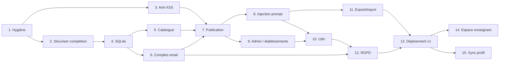

# Planning de migration EduChat → plateforme de tuteurs socratiques

Ce dossier contient l'analyse du site existant, les décisions d'architecture (**v2** — toutes les questions ont été tranchées par le client) et un plan en **15 étapes** — chaque fiche se termine par un **prompt autonome à copier-coller dans une nouvelle session Claude Code** pour réaliser l'étape.

## Comment l'utiliser

1. Lire [00-analyse-existant.md](00-analyse-existant.md) (ce que fait le site aujourd'hui) et [decisions-techniques.md](decisions-techniques.md) (les choix structurants v2).
2. [questions-suggestions.md](questions-suggestions.md) est l'enregistrement des réponses du client — plus aucune question bloquante.
3. Dérouler les étapes **dans l'ordre** : ouvrir la fiche, copier le bloc « Prompt à copier-coller », le coller dans une session Claude Code, vérifier les critères d'acceptation, commiter. Une étape ≈ une session de travail.

## Les 15 étapes

| # | Fiche | Dépend de | Estimation |
|---|---|---|---|
| 1 | [Hygiène du dépôt : secrets, commit de référence, code mort](01-hygiene-depot.md) | — | 1 session |
| 2 | [Verrouiller `/api/completion` (edge→Node) + compteur de tokens](02-securiser-api-completion.md) | 1 | 1 session |
| 3 | [Assainir le rendu (anti-XSS) et durcir l'import JSON](03-sanitisation-xss.md) | 1 | 1 session |
| 4 | [Base SQLite et modèle de données](04-base-sqlite.md) | 2 | 1 session |
| 5 | [API prompts (lecture) + page d'accueil catalogue triable](05-catalogue-accueil.md) | 4 | 1-2 sessions |
| 6 | [Vérification email et comptes sans mot de passe](06-verification-email.md) | 4 | 1-2 sessions |
| 7 | [Publication : brouillons, URL secrète, quotas, droits](07-publication-quotas.md) | 3, 5, 6 | 1-2 sessions |
| 8 | [Injection serveur du prompt système + statistiques d'usage](08-injection-prompt-stats.md) | 7 | 1 session |
| 9 | [Administration : établissements, quotas, clés, modération, facturation](09-administration.md) | 7 | 2-3 sessions |
| 10 | [Internationalisation fr/en/it/de + traduction des prompts](10-i18n.md) | 8, 9 | 2 sessions |
| 11 | [Export/import consolidés et robustesse de l'historique](11-export-import.md) | 8 | 1 session |
| 12 | [Mise en conformité RGPD/nLPD](12-rgpd.md) | 6, 10 | 1 session |
| 13 | [Déploiement Docker, Nginx Proxy Manager, DNS et recette v1](13-deploiement-ovh.md) | 11, 12 | 1-2 sessions + actions manuelles OVH/NPM |
| 14 | [Espace enseignant et réglages de session](14-espace-enseignant.md) | 6, 8, 9 | 1-2 sessions |
| 15 | [Synchronisation serveur du profil (opt-in)](15-sync-profil.md) | 6, 11 | 1 session |

**Total : ~17-21 sessions.** Le **palier v1** se déploie à l'étape 13 (catalogue + tuteurs + admin + i18n + RGPD) ; les étapes **14-15 sont des incréments post-v1** (espace prof, sync de profil) déployables ensuite.

## Règles d'or (valables à toutes les étapes)

- **Jamais de secret en query string** (codes de vérification en fragment `#` + POST) — le journal public des logs est supprimé, mais la règle reste, par principe.
- **Jamais commiter** `.env`, `secret.txt`, `data/` — le `.gitignore` les couvre, mais vérifier avant chaque commit.
- **La base SQLite vit hors `/var/www/html`** (`DATA_DIR`) : un des deux VirtualHost sert ce répertoire en statique.
- **Les élèves n'ont jamais de compte** : tout ce qui exige une identité (publication, administration, réglages de session, sync) passe par les comptes vérifiés par email (promptagogues, enseignants, admins) — jamais par les élèves.
- **Ne pas réordonner les étapes de sécurité** : la sanitisation (3) doit précéder l'ouverture des publications (7) ; le verrouillage de `/api/completion` (2) doit précéder toute publicité du site ; la page `/rgpd` réécrite (12) doit être en production avant l'ouverture réelle des comptes.

## Actions manuelles hors code (à faire par vous)

- **Email** : créer la boîte `noreply@educh.at` (MX Plan OVH inclus — **pas encore créée**) et poser SPF/DKIM dans la zone DNS. Prérequis bloquant de l'étape 6.
- **DNS** : pointer l'enregistrement A du domaine vers `91.134.241.141` (zone DNS OVH). Étape 13.
- **Nginx Proxy Manager** : créer le *Proxy Host* `educh.at` → `http://educhat:3000` et demander le certificat Let's Encrypt, **après** la propagation DNS. Étape 13.
- **Ancien serveur** : décider avec Stéphane de son décommissionnement une fois la bascule validée.

## Le déploiement en une phrase

EduChat tourne en **conteneur Docker** (`Dockerfile`, `docker-compose.yml` à la racine du dépôt) sur `91.134.241.141`, sans publier de port, rejoignant le réseau `proxy-network` où **Nginx Proxy Manager** assure le HTTPS. Mise à jour : `git pull && docker compose up -d --build`. Le dossier `conf/` du dépôt est **obsolète** (ancien serveur Apache/systemd).
